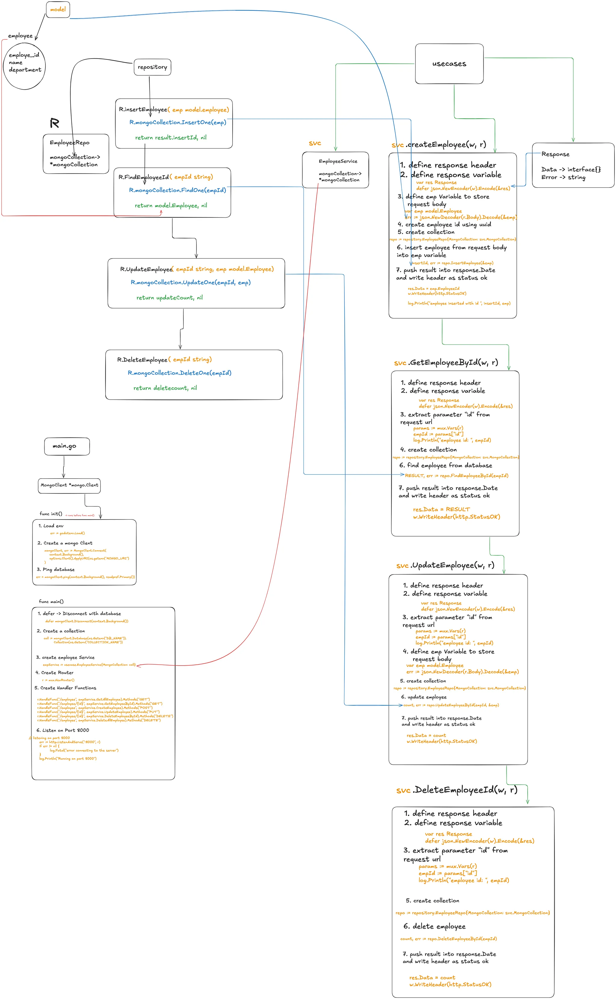

# Go_MongoDB CRUD API

This repository demonstrates a CRUD (Create, Read, Update, Delete) API implementation using Go and MongoDB. The project includes a RESTful API for managing employee records, as well as unit tests for MongoDB operations.

---

## Table of Contents

- [Features](#features)
- [Technologies Used](#technologies-used)
- [Getting Started](#getting-started)
  - [Prerequisites](#prerequisites)
  - [Installation](#installation)
  - [Environment Variables](#environment-variables)
- [API Endpoints](#api-endpoints)
- [Testing](#testing)
- [Project Structure](#project-structure)
- [Contributing](#contributing)
- [License](#license)

---

## Features

- RESTful API for managing employee records.
- MongoDB integration using the `mongo-driver`.
- Unit tests for CRUD operations.
- Environment variable management using `godotenv`.

---

## Technologies Used

- **Programming Language:** Go
- **Database:** MongoDB
- **Frameworks/Libraries:**
  - [Gorilla Mux](https://github.com/gorilla/mux) - HTTP router
  - [MongoDB Driver](https://pkg.go.dev/go.mongodb.org/mongo-driver) - MongoDB integration
  - [Google UUID](https://github.com/google/uuid) - UUID generation
  - [godotenv](https://github.com/joho/godotenv) - Environment variable management

---

## WorkFlow
    


## Getting Started

### Prerequisites

1. Install Go (https://golang.org/dl/).
2. Install MongoDB and ensure it is running locally or use MongoDB Atlas.

### Installation

1. Clone the repository:
   ```bash
   git clone https://github.com/TheMikeKaisen/Go_Mongodb.git
   cd Go_MongoDB
   ```
2. Install dependencies:
   ```bash
   go mod tidy
   ```

3. Set up MongoDB (local or remote) and update the `.env` file.

### Environment Variables

Create a `.env` file in the root directory with the following variables:

```env
MONGO_URI=mongodb://localhost:27017
DB_NAME=companydb
COLLECTION_NAME=employees
```

---

## API Endpoints

| Endpoint              | Method | Description                  |
|-----------------------|--------|------------------------------|
| `/health`             | GET    | Health check for the API     |
| `/employee`           | GET    | Get all employees            |
| `/employee/{id}`      | GET    | Get an employee by ID        |
| `/employee`           | POST   | Create a new employee        |
| `/employee/{id}`      | PUT    | Update an employee by ID     |
| `/employee/{id}`      | DELETE | Delete an employee by ID     |
| `/employee`           | DELETE | Delete all employees         |

---

## Testing

Unit tests are included to validate MongoDB CRUD operations.

Run tests with:

```bash
go test ./repository
```

The tests include scenarios for:
- Inserting employees
- Retrieving employees by ID
- Retrieving all employees
- Updating employees
- Deleting employees by ID
- Deleting all employees

---

## Project Structure

```
.
├── model
│   └── employee.go       # Employee struct
├── repository
│   ├── employee_repo.go  # MongoDB repository methods
│   └── repo_test.go      # Unit tests for MongoDB operations
├── usecase
│   └── employee_service.go # Business logic for employee management
├── main.go               # Entry point for the application
├── .env                  # Environment variables (not committed to Git)
├── go.mod                # Module dependencies
├── go.sum                # Dependency checksums
└── README.md             # Project documentation
```

---

## Contributing

Contributions are welcome! Please open an issue or submit a pull request.

---

## License

This project is licensed under the MIT License. See the [LICENSE](LICENSE) file for details.

